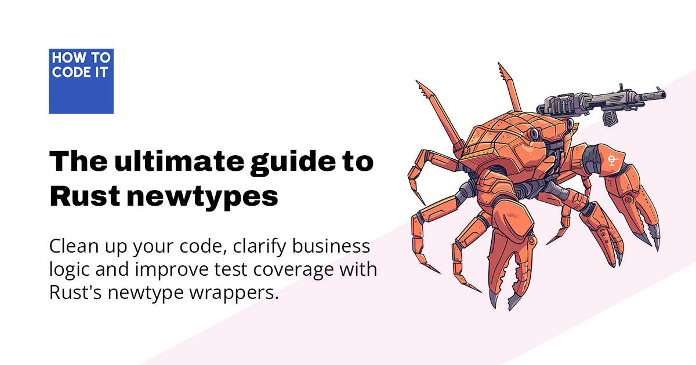

# Exercise solutions: The Ultimate Guide to Rust Newtypes

My approaches to solving the exercises
for [The Ultimate Guide to Rust Newtypes](https://howtocodeit.com/articles/ultimate-guide-rust-newtypes#exercises).

Each solution is presented as its own module (`ex1`, `ex2`, etc.), complete with comments so you can follow my thought
process. All solutions are fully tested.

Exercise 3 has a particularly chunky solution. With this one, I wanted to hint at how a well-thought-through,
single-purpose solution can be generalized into a full Rust library.

Questions or comments on these solutions? Head over to [the discussion on _How To Code
It_](https://howtocodeit.com/articles/ultimate-guide-rust-newtypes#discussion)!